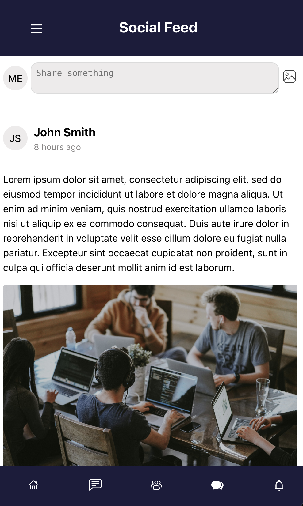

# Wyzetalk Social Feed in Svelte

This project implements a simple **Wyzetalk App Social Feed UI** in Svelte, showcasing a post feed with user interactions.

## Preview



## Features
- Post input box
- User profile avatars and timestamps
- Image and text-based posts
- Bottom navigation bar with icons

## Installation

1. **Clone the repository:**
   ```sh
   git clone https://github.com/your-repo/svelte-social-feed.git
   cd svelte-social-feed
   ```
2. **Install dependencies:**
   ```sh
   npm install
   ```
3. **Run the development server:**
   ```sh
   npm run dev
   ```

## Usage

- Type into the "Share something" input box to create a post.
- View posts from other users with text and images.
- Navigate through different sections using the bottom navigation.

## File Structure

```
📂 svelte-social-feed
├── 📂 src
│   ├── 📂 components
│   │   ├── BottomNav.svelte
│   │   ├── NavBar.svelte
│   │   ├── Post.svelte
│   │   ├── PostInput.svelte
│   ├── 📂 assets
│   │   ├── feed.png
│   ├── App.svelte
│   ├── main.ts
├── package.json
└── README.md
```

## Technologies Used
- [Svelte](https://svelte.dev/)
- [TypeScript](https://www.typescriptlang.org/)

## License
This project is licensed under the MIT License.

---

Feel free to update this `README.md` to fit your project structure and requirements!
